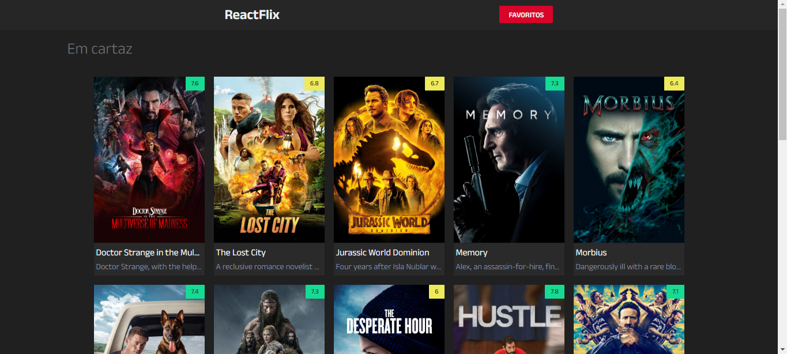
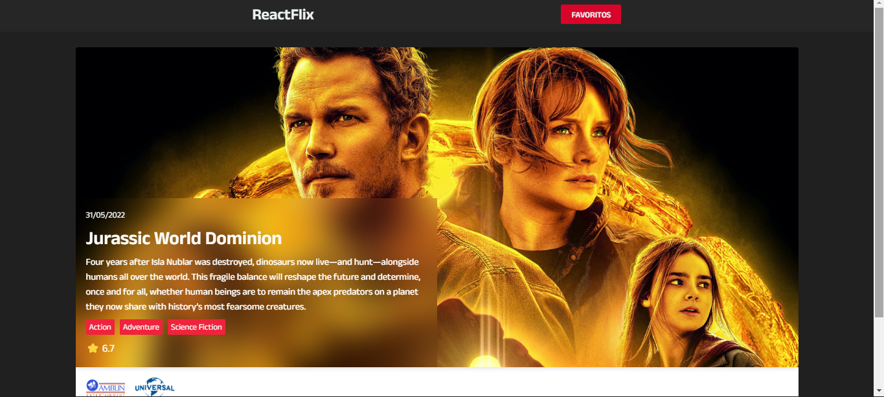
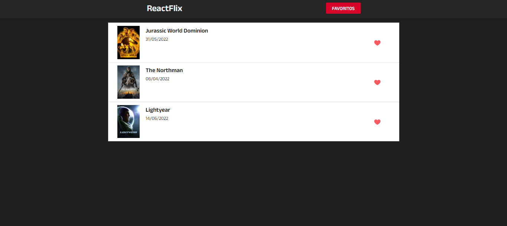
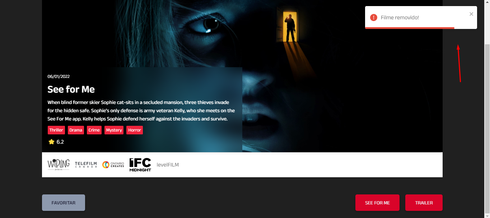
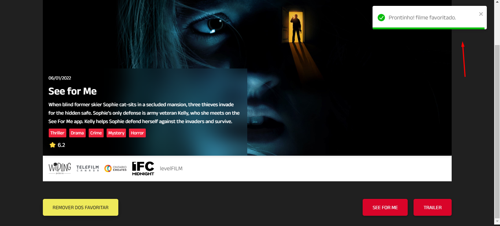

# ReactFlix
### Projeto com ReactJS para fins de estudo do framework.

Live: [reactflix](https://reactflix-nine.vercel.app/filme/539972)

# Dependências
* [React-Toastify](https://fkhadra.github.io/react-toastify/introduction)

* [mdb-react-ui-kit](https://mdbootstrap.com)

* [react-loading-skeleton](https://www.npmjs.com/package/react-loading-skeleton)

* [axios](https://axios-http.com/ptbr/docs/intro)

* [react-router-dom](https://www.npmjs.com/package/react-router-dom)

# Preview

# Network

